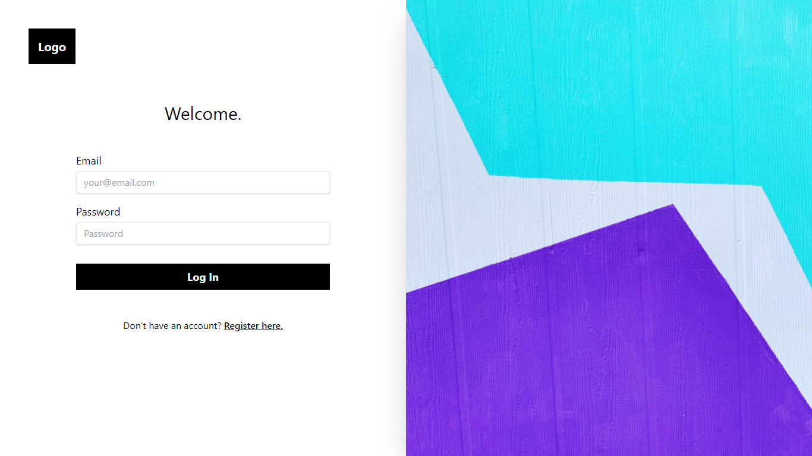
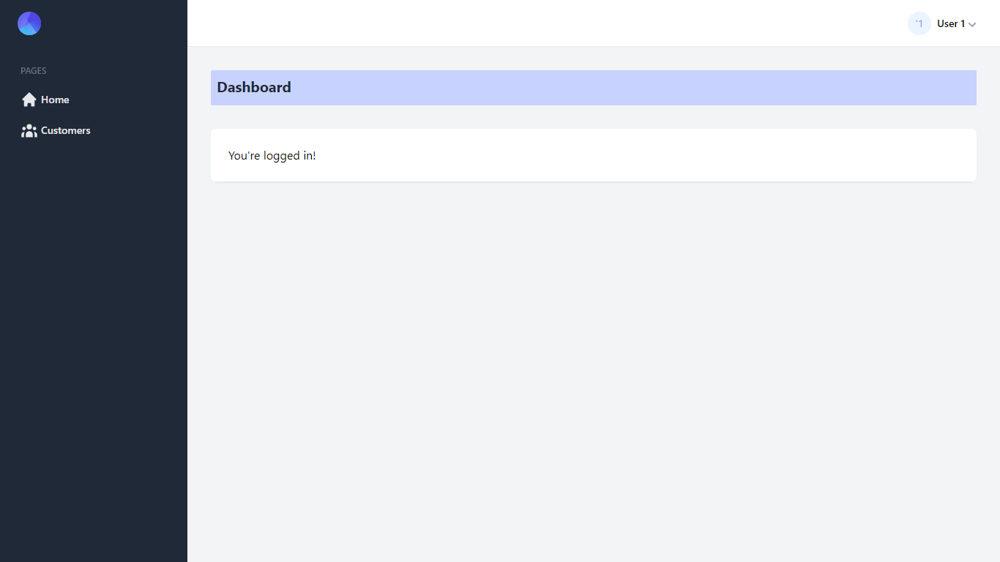
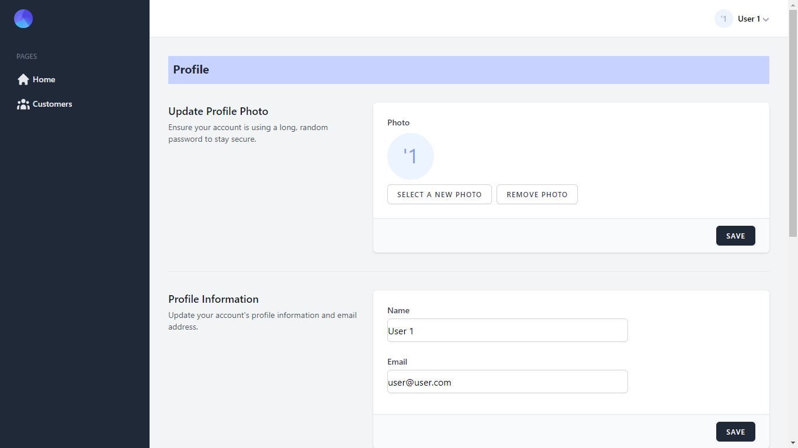
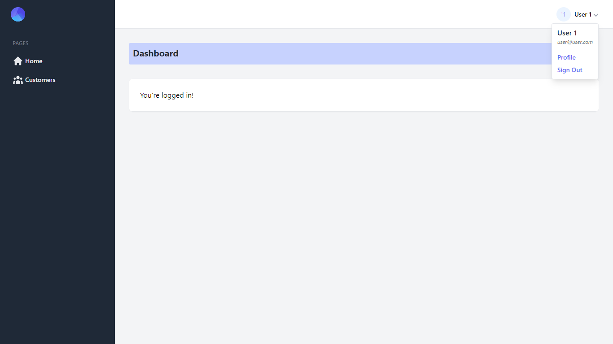

<<<<<<< HEAD
# docker-laravel 🐳


## Introduction

Build a simple laravel development environment with docker-compose.

## Usage

```bash
$ git clone git@github.com:ucan-lab/docker-laravel.git
$ cd docker-laravel
$ make create-project # Install the latest Laravel project
$ make install-recommend-packages # Optional
```

http://localhost

## Tips

- Read this [Makefile](https://github.com/ucan-lab/docker-laravel/blob/main/Makefile).
- Read this [Wiki](https://github.com/ucan-lab/docker-laravel/wiki).

## Container structures

```bash
├── app
├── web
└── db
```

### app container

- Base image
  - [php](https://hub.docker.com/_/php):8.0-fpm-buster
  - [composer](https://hub.docker.com/_/composer):2.0

### web container

- Base image
  - [nginx](https://hub.docker.com/_/nginx):1.20-alpine
  - [node](https://hub.docker.com/_/node):16-alpine

### db container

- Base image
  - [mysql/mysql-server](https://hub.docker.com/r/mysql/mysql-server):8.0
=======
# Atlas

## Laravel React Inertia Tailwind starter kit

Includes Laravel Fortify for authentication

## Introduction

This starter kit provides a minimal and simple starting point for building a Laravel application with authentication. Styled with Tailwind. It also includes [Laravel Fortify](https://laravel.com/docs/8.x/fortify) which publishes authentication controllers to your application that can be easily customized based on your own application's needs.

This starter is powered by React, Inertia, Tailwind and Laravel.

### Includes

-   Laravel v8.40
-   Laravel fortify v1.7
-   Laravel sail v1.0.1
-   React v17.0.2
-   React prop-types v15.7.2
-   Inertia v0.8.7
-   Inertia-react v0.5.12
-   Inertia-laravel v0.4.2
-   Inertia-progress v0.2.4
-   Tailwindcss v2.1.2
-   Ziggy v1.2

## Notable Packages

-   [Laravel](https://laravel.com) - Backend 🎰
-   [ReactJs](https://reactjs.com) - Frontend 💻
-   [InertiaJs](https://inertiajs.com) - Mediator(Helps discard API) 🧑‍🦯
-   [Tailwindcss](https://tailwindcss.com) - Styling 💅

## How do I set this up

### Installation Via Composer

If your computer already has PHP and Composer installed, you may create a new project by using Composer directly.

```bash
composer create-project nwanguma/atlas your-project-name

cd your-project-name

npm install

npm run dev

cp .env.example .env

php artisan key:generate

php artisan storage:link
```

## To remove the documentation

-   windows
    ```bash
    rmdir /s docs
    del README.md
    echo "" > README.md
    ```
-   linux
    ```bash
    rm -r docs
    rm README.md
    touch README.md
    ```

## Just Reminders 😅

-   Make Hard Visits with

    ```
    Inertia::Location(route('login'));
    ```

    Good for those pages that require refresh of sessions, to avoid 419 error (Page Expired).

-   Global alias

    ```bash
    const path = require('path');

    .webpackConfig({
        resolve: {
            alias: {
                '@': path.resolve('resources/js')
            },
        },
    });
    ```

    I made a global alias '@' for absolute path imports.

## How it looks








>>>>>>> change
